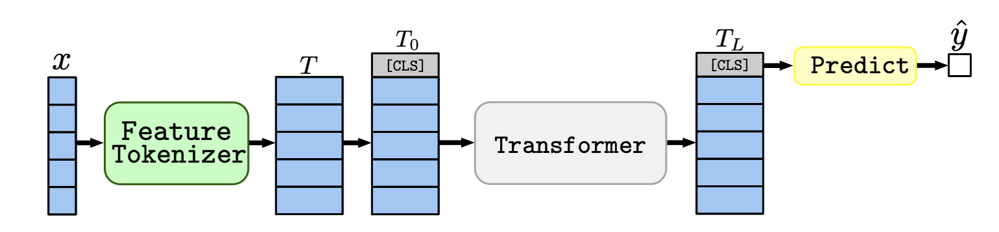
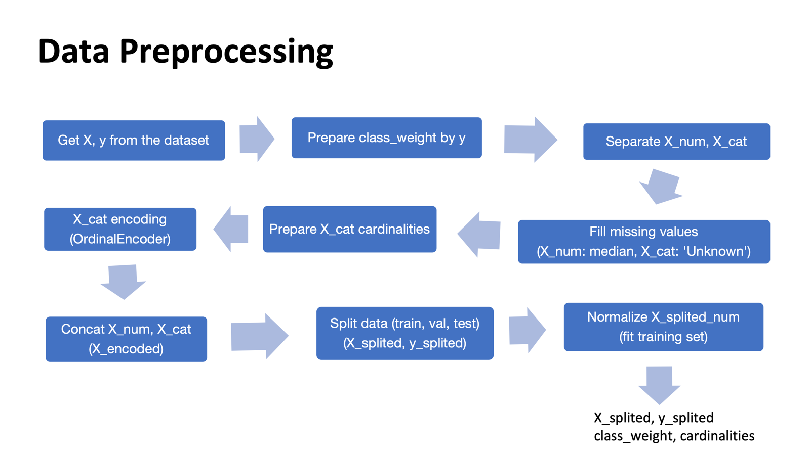

# Using FT Transformer for Sepsis Prediction
### This project aims to assist our partner hospital's Emergency Department (ED) in developing a sepsis early prediction system using electronic health records (EHRs) and a state-of-the-art FT Transformer model.

### Sepsis
Sepsis is a life-threatening condition that arises when the body's response to infection causes injury to its own tissues and organs

#### Challenges in Sepsis Diagnosis:
- Sepsis is commonly misdiagnosed and mistreated because deterioration with organ failure is also common in other diseases. 
- The diagnosis of sepsis is often equivocal due to the varied nature of infection sources and wide-ranging patients’ responses. 
- The diversity in age, gender, and comorbidities affect the symptoms and outcome of septic patients.

#### Why Machine Learning?
- Extract complex patterns from structured (e.g., vitals, labs) and unstructured (e.g., notes) EHR data.

- Provide real-time clinical support for sepsis diagnosis in high-pressure ED environments.

- Improve diagnostic accuracy and reduce treatment delays.

####  FT Transformer (Feature Tokenizer Transformer)
The FT Transformer is a powerful model architecture designed to handle tabular data efficiently, offering:

- A Feature Tokenizer that converts heterogeneous input features into embeddings.

- A Transformer encoder that models feature interactions.

- Superior performance in many tabular data tasks compared to traditional models.

Reference Paper:  
Gorishniy et al., "Revisiting Deep Learning Models for Tabular Data," 
[Link to paper](https://arxiv.org/abs/2106.11959)

## 1. data_preprocessing demo
A step-by-step demo of how raw EHR data is cleaned, encoded, and transformed into a format suitable for the FT Transformer model.

`data_preprocessing_demo.ipynb`

## 2. model training demo
A notebook showcasing how to train the FT Transformer model for sepsis prediction using processed EHR data.

`model_train_demo.ipynb`
